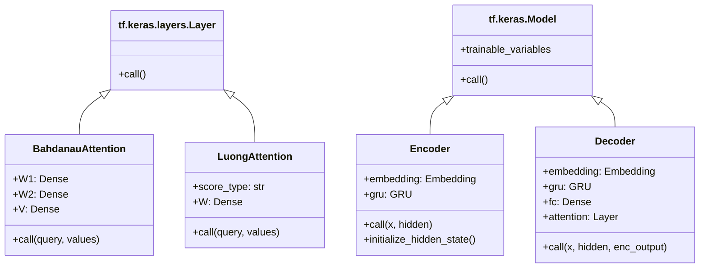

# API Overview

Complete reference for all classes and functions in the codebase.

## Class Hierarchy



## Module Structure

```
seq2seq_attention_comparison.py
├── Data Preprocessing
│   ├── unicode_to_ascii()
│   ├── preprocess_sentence()
│   ├── create_dataset()
│   ├── tokenize()
│   └── load_dataset()
│
├── Attention Layers
│   ├── BahdanauAttention
│   └── LuongAttention
│
├── Model Components
│   ├── Encoder
│   └── Decoder
│
├── Training
│   ├── loss_function()
│   ├── train_step()
│   └── train_model()
│
├── Evaluation
│   ├── evaluate_sentence()
│   └── plot_attention()
│
├── Comparison
│   ├── plot_training_comparison()
│   ├── compare_attention_weights()
│   └── generate_summary()
│
└── main()
```

## Quick Reference

| Class/Function | Purpose | Docs |
|----------------|---------|------|
| `BahdanauAttention` | Additive attention layer | [Details](attention-layers.md#bahdanauattention) |
| `LuongAttention` | Multiplicative attention layer | [Details](attention-layers.md#luongattention) |
| `Encoder` | Source sequence encoder | [Details](encoder-decoder.md#encoder) |
| `Decoder` | Target sequence decoder | [Details](encoder-decoder.md#decoder) |
| `train_step` | Single gradient update | [Details](training-functions.md#train_step) |
| `evaluate_sentence` | Translate with attention | [Details](evaluation-functions.md#evaluate_sentence) |

---

[← Back to Index](../index.md) | [Next: Attention Layers →](attention-layers.md)
